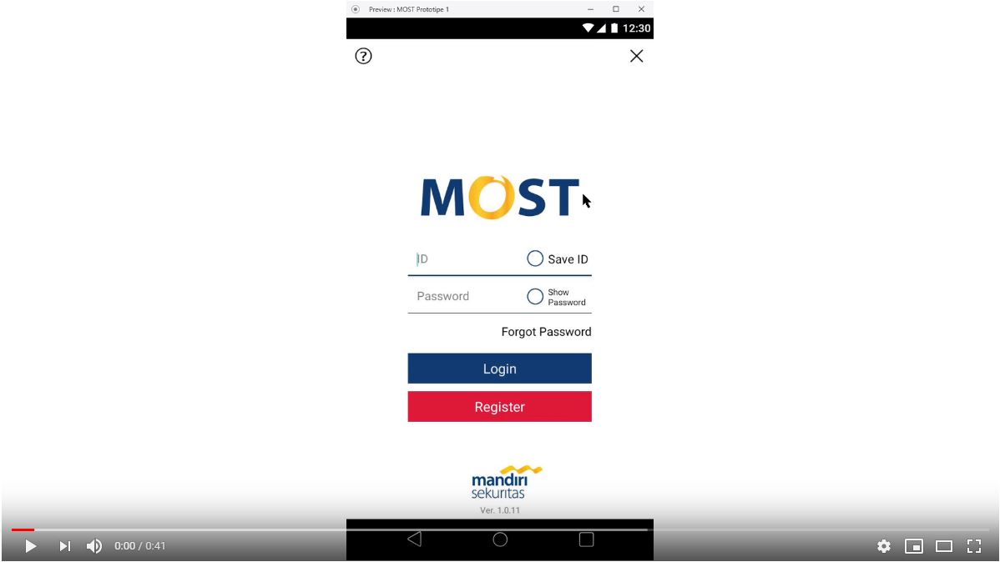
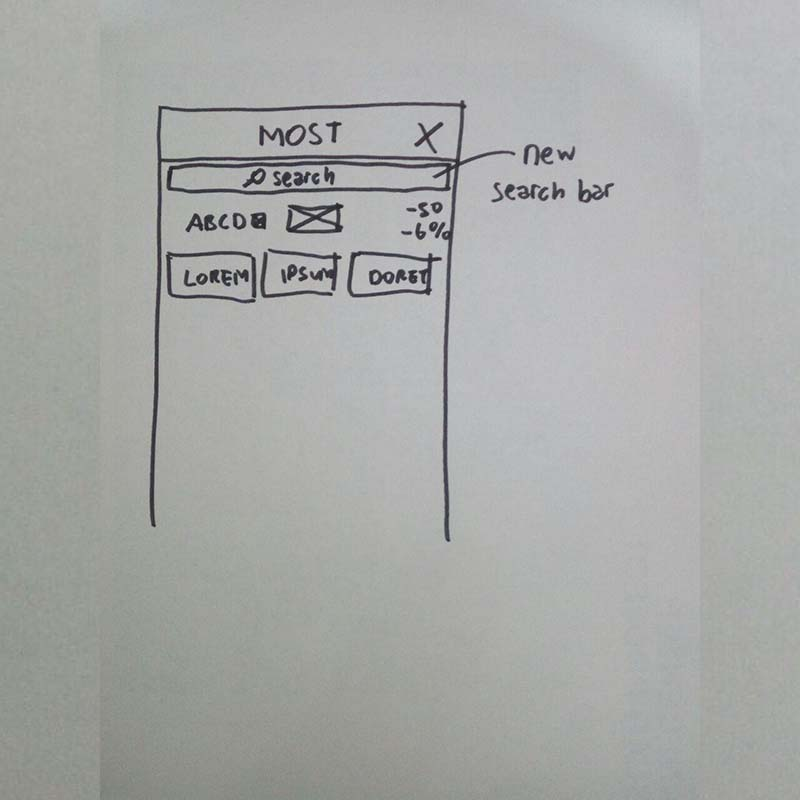

# Usability Evaluation and Prototyping (again)
## Operating the Prototype

## Part A: Usability Evaluation
### 1. Brief Description of Participants
#### a. Description of Participant 1
 - Age around 20-25
 - Is never use trading/investing apps before
 - Has no knowledge to trading/investing
 - Use smartphone in daily basis

#### b. Description of Participant 2
 - Age around 20-25
 - Has ever use trading/investing apps before
 - Has knowledge to trading/investing
 - Use smartphone in daily basis

### 2. Evaluation Script
1. Login
2. Buy and Sell Stock
3. Find stock's financial fact

### 3. Transcript

#### a. Transcript with Participant 1
 1. **You**: Mari kita mulai. Terimakasih sebelumnya karena sudah mau membantu tugas saya. Ini adalah prototipe aplikasi trading mandiri sekuritas. Pernah trading/investasi saham sebelumnya?
 2. **Participant**: Belum
 3. **You**: Oke gapapa. Ada beberapa objektif yang harus kamu lakukan untuk mendapatkan feedback dari prototipe ini. Yang pertama, coba kamu menggunakan fitur login. Oh iya beberapa fitur hanya sebagai dummy, jadi tidak terlalu nyata. 
 4. **Participant**: Aneh sih karena mungkin ini bukan apps beneran ya
 5. **You**: Well, iya makanya itu beberapa fitur nanti cuma tampilan aja. Oke login sudah berhasil selanjutnya dari halaman itu coba kita bertansaksi saham. Lakukan proses jual atau beli saham
 6. **Participant**: Oke ini sudah
 7. **You**: Gimana rasanya?
 8. **Participant**: Bagus kok. Cuma rasanya ini ditaruh sini semua ya?
 9. **You**: Iya. Oke berikutnya kita coba cari namanya laporan keuangan perusahaan. Mungkin agak sulit tapi coba kamu cari.
 10. **Participant**: Laporan perusahaan itu bentuknya gimana?
 11. **You**: Nanti ada halaman yang menunjukkan chart-chart aneh yang isinya ada kata-kata kaya net income, profit intinya berbau keuangan atau bisnis.
 12. **Participant**: Mutual funds ini apa?
 13. **You**: Oh itu nama lainnya reksadana. Tapi kamu gabakal nemu apa-apa disitu karena kosong.
 14. **Participant**: Iya, barusan aku liat. Oh di stock information ini?
 15. **You**: Gatau coba aja.
 16. **Participant**: Hmm lumayan bagus.
 17. **You**: Nah oke kamu nemu. Itu namanya financial fact atau laporan keuangan perusahaan. Jadi overall gimana setelah mencoba prototipe aplikasi ini?
 18. **Participant**: Cukup intuitif rasanya karena ada icon-icon dan judul yang jelas yang mungkin merefer ke action berikutnya. Tapi ya karena ini cuma prototipe jadi ya gabener-bener nyata.
 19. **You**: Oke, terimakasih ya.

#### b. Transcript with Participant 2
1. **You**: Halo wkwkwk. Langsung aja ya, ini aku punya prototipe trading appsnya mandiri sekuritas. Nah ada tiga hal yang harus kamu lakukan. Ya tipikal lah kaya apps lainnya. Nah coba nanti kamu kasih komentar tentang prototipeku ini. 
2. **Participant**: Loh bentar ini kok halaman utamanya tetep?
3. **You**: Iya ada beberapa halaman yang aku ambil dari apps nya langsung supaya tetep *remain high* di problem yang aku tangani. Oke, yang pertama coba login, terus order beli/jual. Gampang lah ya.
4. **Participant**: Yah kok ga diganti tampilan jual-belinya?
5. **You**: heheheh
6. **Participant**: Mungkin kalo diganti supaya selaras gitu baru kerasa bedanya.
7. **You**: Yes bener. oke ini yang terakhir ya coba cari informasi laporan keuangan saham tertentu.
8. **Participant**: Ini ga ada search barnya ya? Agak kesulitan sih ini kalo cari satu-satu. Atau emang ini karena prototipe?
9. **You**: I see, thanks for notice in it. Iya berarti emang harus ada search bar disitu.
10. **Participant**: Oke ini overall konsepnya bagus kok aku lihat.
11. **You**: thank you, any comment?
12. **Participant**: Ya itu tadi soal search bar.

### 4. Feedback and Incidence Analysis

#### OBSERVATION 1 (Login Operation)

 - **Reference**: Participant 1: 8, Participant 2: 2
 - **Feedback**: Welcome page and login page is still the same with current app.
 - **Incidence**: None.
 - **Reason**: None.
 - **Resolution**: Design a new login page.
 
#### OBSERVATION 2 (Buy / Sell Operation)

 - **Reference**: Participant 1: 8, Participant 2: 2
 - **Feedback**: Overall good. Buy Stock Page is still the same with current app.
 - **Incidence**: None.
 - **Reason**: None.
 - **Resolution**: Design a new login page.
 
#### OBSERVATION 3 (Financial Fact)

 - **Reference**: Participant 1: 16, Participant 2: 8
 - **Feedback**: There is no search bar to find another stock.
 - **Incidence**: None.
 - **Reason**: None.
 - **Resolution**: Add search bar.

## Part B: Prototyping (again)
### Sketch

### Design Rationale
It is important that design should address spesific user. Not all user able to intuitively interact with the design that designers create. Hence, user-based design is fundamental to determine the design itself.

### High-Fidelity Interactive-Prototype

